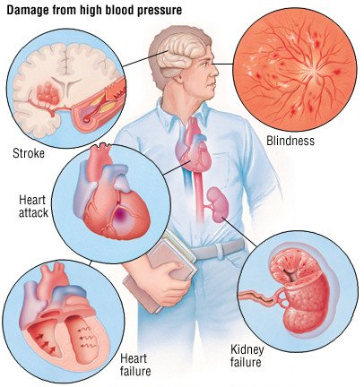

```{r steup,include=FALSE, echo=FALSE}
rm(list = ls())
library("rstan")
library("dplyr")
library("loo")
library("ggplot2")
library("tibble")
options(digits = 3)
knitr::opts_chunk$set(warning=FALSE)
data <- read.csv(file = 'diabetes.csv')
```

# 1. Introduction

The motivation for this project is to estimate the parameters for blood pressure data with the help of Bayesian methods. High blood pressure corresponds with different diseases, such as diabetes and heart diseases. This means that it is essential to predict distribution of blood pressure and its parameters in an accurate way.

Solving the problem, firstly, we want to estimate what type of distribution can describe blood pressure. Then with different Bayesian models estimate the parameters for the distribution. We will also investigate how the parameters differ when dividing the data into different age groups. Higher blood pressure could correspond with higher age.

The main modeling idea is to test, with different Bayesian models, how to get accurate estimates of the parameters that could describe blood pressure. This answers the research question of whether older and younger people have different models describing their blood pressure, and therefore have different blood pressures.
---
nocite: |
  @high_blood_pressure
---


# 2. Description of the data

We used blood pressure data combined with age data from the [Diabetes Dataset from Kaggle](https://www.kaggle.com/mathchi/diabetes-data-set). According to the data description, the dataset is originally from the National Institute of Diabetes and Digestive and Kidney Diseases, and one data point corresponds to a female patient of Pima Indian heritage. All patients are at least 21 years old.

The dataset has more columns than we used, for example number of pregnancies, BMI and diabetes classification. We only used the columns BloodPressure, describing the diastolic blood pressure, and Age, describing the age of the patient in years. The diastolic blood pressure is the pressure the heart applies on the walls of the arteries between the beats (@diastolic_pressure). The unit for the diastolic blood pressure is mmHg, and a normal value is usually below 80. Higher values might indicate hypertension, which increases with age in Western countries (@gurven_blackwell_rodriguez_stieglitz_kaplan_2012).

We separated the data in two parts based on age group. Using the cutoff value 30 for age, we got an younger and an older group with 394 and 338 patients respectively. The groups will from here be referred to as "young group" and "old group". The code and the plot for the groups separately can be seen below.

```{r}
data <- data %>%
  filter(BloodPressure > 0) %>%
  select(BloodPressure, Age) %>%
  mutate(AgeGroup = case_when(
  Age <= 30      ~ "Young",
  Age > 30       ~ "Old")
  )
knitr::kable(head(data),
             caption = "The first rows of the dataset, with the additinal 'AgeGroup' column.")
```

```{r, warning=FALSE, echo=FALSE, fig.cap="A histogram of the complete data set for the blood pressure. A density approximation plot and a mean line is included as well."}
ggplot(data, aes(x=BloodPressure)) +
  geom_histogram(aes(y=..density..), binwidth = 5, colour="black",position = "identity", colour="black", fill="white") +
  geom_density(alpha=.2, fill="#FF6666") +
  geom_vline(aes(xintercept=mean(BloodPressure)), color="#FF6666", linetype="dashed", size=1)
```

```{r, fig.cap="Histograms with density approximations and mean lines for both age groups."}
means <- data %>%
  group_by(AgeGroup) %>%
  summarise(mean = mean(BloodPressure), n = n())

ggplot(data, aes(x=BloodPressure, fill=AgeGroup)) +
  geom_histogram(aes(y=..density..),
                 binwidth = 5,
                 colour="black",
                 position = "identity",
                 alpha = 0.4) +
  geom_vline(data = means, aes(xintercept=mean, color = AgeGroup), linetype="dashed", size=1) +
  geom_density(alpha=.2)
```

```{r, echo=FALSE, fig.cap="The bloodpressure and age scatterplotted for each data point."}
ggplot(data, aes(x=Age, y=BloodPressure, color=AgeGroup)) + geom_point() 
```

# 3. Description of the models

We used two models, one hierarchical and one nonhierarchical, and ran each model two times (once per age group). Therefore we got four fits: hierarchical for the old group, nonhierarchical for the old group, hierarchical for the young group, and nonhierarchical for the young group. The data looks normally distributed (which is very natural in its biological context), so we base our models on the normal distribution.

The nonhierarchical model can be mathematically summarized as 

$$y_{ij} \sim \mathcal{N}(\mu_j, \sigma_j)$$

$$\mu_j \sim \mathcal{N}(\mu_{prior}, \sigma_{prior})$$

$$\sigma_j \sim \text{Inv-}\chi^2(Var_{prior})$$,

where $\mu_j$ is the mean, $\sigma_j$ describes the variance, and $y_{ij}$ consists of the posterior draws.

Using the same notation we get the following hierarchical model:

$$y_{ij} \sim \mathcal{N}(\mu_j, \sigma_j)$$

$$\mu_j \sim \mathcal{N}(\mu_{prior}, \sigma_{prior})$$

$$\sigma_j \sim \text{Inv-}\chi^2(Var_{prior})$$

$$\mu_{prior} \sim \mathcal{N}(\mu_{hyperprior}, \tau)$$

$$\sigma_{prior} \sim \text{Inv-}\chi^2(\tau)$$

$$ Var_{prior} \sim \text{Inv-}\chi^2(\tau)$$

Here, $y_{ij}$ consists of the posterior draws, $\mu_j$ is the mean, $\sigma_j$ describes the variance. $\mu_{prior}$, $\sigma_{prior}$, and $Var_{prior}$ are the priors, and $\mu_{hyperprior}$ and $\tau$ are the hyperpriors used for generating the priors for the hierarchical model.

# 4. Priors

We use weekly informative priors for parameters $\mu$, $\sigma$ and $Var$. They are chosen based on the blood pressure data that we get from the data set. From the plotted data we choose priors that possibly could describe a normal distribution describing the blood pressure. $\mu$, $\sigma$ and $Var$ for the distribution of our two different age groups:

For non-hierarchical model:

-  For $Age \leq 30: \mu_{prior} = 71,\:\sigma_{prior}=10,\: Var_{prior}=20$. Our prior $\mu$ is slightly lower here than for the older age group. Other priors stay the same.
-  For $Age > 30: \mu_{prior} = 78,\:\sigma_{prior}=10,\: Var_{prior}=20$. Here the prior $\mu$ is higher, because it can be seen from the plot that the mean is higher, but other priors stay the same.

For hierarchical:

-  For $Age \leq 30: \mu_{hyperprior} = 75,\:\sigma_{hyperprior}=10,\: Var_{hyperprior}=20$. Our prior $\mu$ is slightly lower here than for the older age group. Other priors stay the same.
-  For $Age > 30: \mu_{hyperprior} = 75,\:\sigma_{hyperprior}=10,\: Var_{hyperprior}=20$.

As seen, the hyperpriors are the same for both age group, because the priors are then drawn based on the model.


# 5. Stan code

Below the Stan code for the two models (nonhierarchical and hierarchical) can be seen. 

## Nonhierarchical model 

```{stan, output.var = "nonhieramodel"}
data {
  int<lower=0> N;                  //Amount of data points
  vector[N] y;                     //Data points
  real mean_mu_prior;              //Expected value of the mean prior 
  real<lower=0> mean_sigma_prior;  //variance of the mean prior
  real<lower=0> var_prior;         //Variance of the variance prior
}

parameters {
  real mu;                         //The parameter mu describing the man
  real<lower=0> sigma;             //The parameter sigma describing the variance
}

model {
  //Priors:
  // The prior for the mean, normally distributed
  mu ~ normal(mean_mu_prior, mean_sigma_prior); 
  // The prior for the sigma, inverse Chi-squared distributed
  sigma ~ inv_chi_square(var_prior); 
 //likelihoods
  y ~ normal(mu, sigma);
}

generated quantities {
  real ypred;
  vector[N] log_lik;
  ypred = normal_rng(mu, sigma);
  for (n in 1:(N)){
    log_lik[n] = normal_lpdf(y[n] | mu, sigma);
  }
}

```

## Hierarchical model

```{stan, output.var = "hieramodel"}
data {
  int<lower=0> N;                  //Amount of data points
  vector[N] y;                     //Data points
  real mean_mu_prior;              //Expected value of the mean prior
  real<lower=0> mean_sigma_prior;  //Variance of the mean prior
  real<lower=0> var_prior;         //Variance of the variance prior
}

parameters {
  real mu;                         //The parameter mu describing the man 
  real<lower=0> sigma;             //The parameter sigma describing the variance
  real mu_hypo;                    //The hyperparameter describing the mean of the hyperprior
  real<lower=0> tau;               //The hyperparameter describing the variance of the hyperpriors
}

model {
  //Hyperpriors
  //The hyperprior for the mean, normally distributed
  mu_hypo ~ normal(mean_mu_prior, mean_sigma_prior);
  //The hyperprior for the variance, inverse chi-square distributed
  tau ~ inv_chi_square(var_prior);
  //Priors:
  // The prior for the mean, normally distributed
  mu ~ normal(mu_hypo, tau);
  sigma ~ inv_chi_square(var_prior);
 //likelihoods
  y ~ normal(mu, sigma);
}

generated quantities {
  real ypred;
  vector[N] log_lik;
  ypred = normal_rng(mu, sigma);
  for (n in 1:(N)){
    log_lik[n] = normal_lpdf(y[n] | mu, sigma);
  }
}

```

# 6. Running the Stan model


We will need to run both of the models twice to get a model both for the young group and the old group. Therefore, we repeat almost the same process four times. The code is not included for all models for this reason. All models are ran with 4 chains and 2000 chains, of which half of the chain (1000 iterations) is considered warmup.

## Nonhierarchical model

The nonhierarchical model uses $\mu_{old}=75$, $\mu_{young}=65$, $\sigma_{prior}=10$, $\text{Var}_{prior}=20$. The data used is the blood pressure data from the dataset for the age group respectively.

### Old group

In this section we can see the data used in the separate model for the old age group.
```{r}
data_old <- data %>%
  filter(AgeGroup == "Old")

mean_mu_prior_old = 75
mean_sigma_prior_old = 10
var_prior_old = 20
data_nonhiera_old <- list(
  y = data_old$BloodPressure,
  N = length(data_old$BloodPressure),
  mean_mu_prior = mean_mu_prior_old,
  mean_sigma_prior = mean_sigma_prior_old,
  var_prior = var_prior_old
)
```

```{r}
fit_nonhiera_old = sampling(nonhieramodel,
  data = data_nonhiera_old,            # named list of data
  chains = 4,             # number of Markov chains
  warmup = 1000,          # number of warmup iterations per chain
  iter = 2000,            # total number of iterations per chain
  cores = 4,              # number of cores (could use one per chain)
  refresh = 0             # no progress shown
  )
```

### Young group

In this section we can see the data used in the separate model for the young age group.
```{r}
data_young <- data %>%
  filter(AgeGroup == "Young")

mean_mu_prior_young = 65
mean_sigma_prior_young = 10
var_prior_young = 20
data_nonhiera_young <- list(
  y = data_young$BloodPressure,
  N = length(data_young$BloodPressure),
  mean_mu_prior = mean_mu_prior_young,
  mean_sigma_prior = mean_sigma_prior_young,
  var_prior = var_prior_young
)
```

```{r, echo=FALSE}
fit_nonhiera_young = sampling(nonhieramodel,
  data = data_nonhiera_young,            # named list of data
  chains = 4,             # number of Markov chains
  warmup = 1000,          # number of warmup iterations per chain
  iter = 2000,            # total number of iterations per chain
  cores = 4,              # number of cores (could use one per chain)
  refresh = 0             # no progress shown
  )
```

## Hierarchical model

The nonhierarchical model uses $\mu=70$ (same for both groups). All other parameters are the same as in the nonhierarchical model.

### Old group

In this section we can see the data used in the hierarchical model for the old age group.
```{r}
mean_mu_prior = 70
mean_sigma_prior = 10
var_prior = 20
data_hiera_old <- list(
  y = data_old$BloodPressure,
  N = length(data_old$BloodPressure),
  mean_mu_prior = mean_mu_prior,
  mean_sigma_prior = mean_sigma_prior_old,
  var_prior = var_prior
)
```

```{r, echo=FALSE}
fit_hiera_old = sampling(hieramodel,
  data = data_hiera_old,            # named list of data
  chains = 4,             # number of Markov chains
  warmup = 1000,          # number of warmup iterations per chain
  iter = 2000,            # total number of iterations per chain
  cores = 4,              # number of cores (could use one per chain)
  refresh = 0             # no progress shown
  )
```

### Young group

In this section we can see the data used in the hierarchical model for the young age group.
```{r}
mean_mu_prior = 70
mean_sigma_prior = 10
var_prior = 20
data_hiera_young <- list(
  y = data_young$BloodPressure,
  N = length(data_young$BloodPressure),
  mean_mu_prior = mean_mu_prior,
  mean_sigma_prior = mean_sigma_prior,
  var_prior = var_prior
)
```

```{r, echo=FALSE}
fit_hiera_young = sampling(hieramodel,
  data = data_hiera_young,            # named list of data
  chains = 4,             # number of Markov chains
  warmup = 1000,          # number of warmup iterations per chain
  iter = 2000,            # total number of iterations per chain
  cores = 4,              # number of cores (could use one per chain)
  refresh = 0             # no progress shown
  )
```


# 7. Convergence diagnostics

We compute the convergence diagnostics for all models. All models have a $\widehat R$ value of <1.05, indicating that the chains have mixed well. The effective sample sizes (ESS) are all over 100, and can be considered good. When plotting the chains we can also see that they are converging well, and there is no need to edit the model or the priors.

```{r, echo=FALSE, warning=FALSE, message=FALSE}
current_monitor <- data.frame(monitor(fit_nonhiera_old, print = FALSE))
diagnostics_names <- c("Variable", colnames(current_monitor)[c(1:3,9:10,21:22)])
rownames <-rownames(current_monitor)
diag_nonhiera_old <- current_monitor %>%
  rownames_to_column(var ="Variable") %>%
  as_tibble() %>%
  select(diagnostics_names) %>%
  slice(1:3)
knitr::kable(diag_nonhiera_old,
             caption = "The diagnostics of the nonhierarcical model for the old age group.")
```

```{r, echo=FALSE, fig.cap="The trace plot of the nonhierarcical model for the old age group."}
traceplot(fit_nonhiera_old, inc_warmup = FALSE, nrow = 3, pars=c("mu", "sigma", "ypred"))
```

```{r, echo=FALSE, warning=FALSE, message=FALSE}
current_monitor <- data.frame(monitor(fit_nonhiera_young, print = FALSE))
diagnostics_names <- c("Variable", colnames(current_monitor)[c(1:3,9:10,21:22)],"Bulk_ESS","Tail_ESS")
rownames <-rownames(current_monitor)
diag_nonhiera_old <- current_monitor %>%
  rownames_to_column(var ="Variable") %>%
  as_tibble() %>%
  select(diagnostics_names) %>%
  slice(1:3)
knitr::kable(diag_nonhiera_old,
             caption = "The diagnostics of the nonhierarcical model for the young age group.")
```

```{r, echo=FALSE, fig.cap="The trace plot of the nonhierarcical model for the young age group."}
traceplot(fit_nonhiera_young, inc_warmup = FALSE, nrow = 3, pars=c("mu", "sigma", "ypred"))
```

```{r, echo=FALSE, warning=FALSE, message=FALSE}
current_monitor <- data.frame(monitor(fit_hiera_old, print = FALSE))
diagnostics_names <- c("Variable", colnames(current_monitor)[c(1:3,9:10,21:22)],"Bulk_ESS","Tail_ESS")
rownames <-rownames(current_monitor)
diag_nonhiera_old <- current_monitor %>%
  rownames_to_column(var ="Variable") %>%
  as_tibble() %>%
  select(diagnostics_names) %>%
  slice(1:5)
knitr::kable(diag_nonhiera_old,
             caption = "The diagnostics of the hierarcical model for the old age group.")
```

```{r, echo=FALSE, fig.cap="The trace plot of the hierarcical model for the old age group."}
traceplot(fit_hiera_old, inc_warmup = FALSE, nrow = 3, pars=c("mu", "sigma", "ypred", "mu_hypo", "tau" ))
```

```{r, echo=FALSE, warning=FALSE, message=FALSE}
current_monitor <- data.frame(monitor(fit_hiera_young, print = FALSE))
diagnostics_names <- c("Variable", colnames(current_monitor)[c(1:3,9:10,21:22)],"Bulk_ESS","Tail_ESS")
rownames <-rownames(current_monitor)
diag_nonhiera_old <- current_monitor %>%
  rownames_to_column(var ="Variable") %>%
  as_tibble() %>%
  select(diagnostics_names) %>%
  slice(1:5)
knitr::kable(diag_nonhiera_old,
             caption = "The diagnostics of the hierarcical model for the young age group.")
```

```{r, echo=FALSE, fig.cap="The trace plot of the hierarcical model for the young age group."}
traceplot(fit_hiera_young, inc_warmup = FALSE, nrow = 3, pars=c("mu", "sigma", "ypred", "mu_hypo", "tau"))
```

```{r, echo=FALSE, fig.cap="The paramters mu and sigma of the posterior scatter ploted of the nonhierarchical model for the old group."}
extract_nonhiera_old <- data.frame(extract(fit_nonhiera_old))
ggplot(data = extract_nonhiera_old ,aes(x=mu, y=sigma))+geom_point()
```

# 8. Posterior predictive checks

We compare the posterior distribution with the original distribution visually. We can see that the posterior distribution is similar to the original distribution in all cases, indicating that the model is working as it should. 

```{r, echo=FALSE}
extract_hiera_old <- data.frame(extract(fit_hiera_old))
extract_nonhiera_old <- data.frame(extract(fit_nonhiera_old))
extract_hiera_young <- data.frame(extract(fit_hiera_young))
extract_nonhiera_young <- data.frame(extract(fit_nonhiera_young))
```

```{r, echo=FALSE, fig.pos='H', fig.cap="Hierarical posterior predictive vs original data for the old age group."}
ggplot(extract_nonhiera_old, aes(x=ypred)) +
  geom_histogram(aes(y=..density..), binwidth = 5, colour="black",position = "identity", colour="black", fill="#F8766D", alpha=0.15)  + 
  geom_histogram(data= data_old, aes(x=BloodPressure,y=..density..), binwidth = 5, colour="black",position = "identity", colour="black", fill="#00BFC4", alpha=0.15) +
  geom_density(aes(colour="Sim"),alpha=.2, fill="#FF6666") +
  geom_density(data=data_old, aes(x=BloodPressure, colour="Orig"),alpha=.2, fill="#0000FF") +
  geom_vline(aes(xintercept=mean(ypred)), colour="#F8766D", linetype="dashed", size=1) +
  geom_vline(data=data_old, aes(xintercept=mean(BloodPressure), color="Orig"), color="#00BFC4", linetype="dashed", size=1) +
  labs(x="Data", y ="Density", colour = "legend") +
  scale_colour_manual(name = 'Denisty', values=c('Sim'='red','Orig'='blue'), labels = c('Predictive posterior','Original data'))
```

```{r, echo=FALSE, fig.pos='h', fig.cap="Hierarical posterior predictive vs original data for the old age group."}
ggplot(extract_hiera_old, aes(x=ypred)) +
  geom_histogram(aes(y=..density..), binwidth = 5, colour="black",position = "identity", colour="black", fill="#F8766D", alpha=0.15)  + 
  geom_histogram(data= data_old, aes(x=BloodPressure,y=..density..), binwidth = 5, colour="black",position = "identity", colour="black", fill="#00BFC4", alpha=0.15) +
  geom_density(aes(colour="Sim"),alpha=.2, fill="#FF6666") +
  geom_density(data=data_old, aes(x=BloodPressure, colour="Orig"),alpha=.2, fill="#0000FF") +
  geom_vline(aes(xintercept=mean(ypred)), colour="#F8766D", linetype="dashed", size=1) +
  geom_vline(data=data_old, aes(xintercept=mean(BloodPressure), color="Orig"), color="#00BFC4", linetype="dashed", size=1) +
  labs(x="Data", y ="Density", colour = "legend") +
  scale_colour_manual(name = 'Denisty', values=c('Sim'='red','Orig'='blue'), labels = c('Predictive posterior','Original data'))
```

```{r, echo=FALSE, fig.pos='h', fig.cap="Posterior predictive distributions of the hierarcical versus non-hierarcical data for the old age group."}
ggplot(extract_hiera_old, aes(x=ypred)) +
  geom_histogram(aes(y=..density..), binwidth = 5, colour="black",position = "identity", colour="black", fill="#F8766D", alpha=0.15)  + 
  geom_histogram(data= extract_nonhiera_old, aes(x=ypred,y=..density..), binwidth = 5, colour="black",position = "identity", colour="black", fill="#00BFC4", alpha=0.15) +
  geom_density(aes(colour="Sim"),alpha=.2, fill="#FF6666") +
  geom_density(data=extract_nonhiera_old, aes(x=ypred, colour="Orig"),alpha=.2, fill="#0000FF") +
  geom_vline(aes(xintercept=mean(ypred)), colour="#F8766D", linetype="dashed", size=1) +
  geom_vline(data=extract_nonhiera_old, aes(xintercept=mean(ypred), color="Orig"), color="#00BFC4", linetype="dashed", size=1) +
  labs(x="Data", y ="Density", colour = "legend") +
  scale_colour_manual(name = 'Denisty', values=c('Sim'='red','Orig'='blue'), labels = c('Hierarical model','Nonhierarcical model'))
```

```{r,echo=FALSE, fig.pos='h', fig.cap="Posterior predictive distributions of the non hierarcical models for the old versus the young age group"}
ggplot(extract_hiera_old, aes(x=ypred)) +
  geom_histogram(aes(y=..density..), binwidth = 5, colour="black",position = "identity", colour="black", fill="#F8766D", alpha=0.15)  + 
  geom_histogram(data= extract_hiera_young, aes(x=ypred,y=..density..), binwidth = 5, colour="black",position = "identity", colour="black", fill="#00BFC4", alpha=0.15) +
  geom_density(aes(colour="Sim"),alpha=.2, fill="#FF6666") +
  geom_density(data=extract_hiera_young, aes(x=ypred, colour="Orig"),alpha=.2, fill="#0000FF") +
  geom_vline(aes(xintercept=mean(ypred)), colour="#F8766D", linetype="dashed", size=1) +
  geom_vline(data=extract_hiera_young, aes(xintercept=mean(ypred), color="Orig"), color="#00BFC4", linetype="dashed", size=1) +
  labs(x="Data", y ="Density", colour = "legend") +
  scale_colour_manual(name = 'Density', values=c('Sim'='red','Orig'='blue'), labels = c('Old age group','Young age group'))
```

# 9. Model comparison with LOO-CV

Next, we compare the nonhierarchical and the hierarchical model with LOO-CV. We can see that both models are equally good for the age groups.

```{r, echo=FALSE, fig.cap="The pareto k values using leave-one-out method for the nonhierarchical model for the old age group."}
loo_nonhiera_old <- loo(fit_nonhiera_old, pars="log_lik")
knitr::kable(loo_nonhiera_old$estimates,
             caption = "The loave-one-out diagnostics of the nonhierarcical model for the old age group.")
plot(loo_nonhiera_old)
```

As we can see, all $\widehat k$ values are smaller than 0.5 for the old group nonhierarchical model, which indicates that the PSIS-LOO estimate is reliable. We get very similar results for the other models and groups, and have therefore left out the plots.

```{r, echo=FALSE}
loo_nonhiera_young <- loo(fit_nonhiera_young, pars="log_lik")
knitr::kable(loo_nonhiera_young$estimates,
             caption = "The loave-one-out diagnostics of the nonhierarcical model for the young age group.")
```

```{r, echo=FALSE}
loo_hiera_old <- loo(fit_nonhiera_old, pars="log_lik")
knitr::kable(loo_hiera_old$estimates,
             caption = "The loave-one-out diagnostics of the hierarcical model for the old age group.")
```

```{r, echo=FALSE}
loo_hiera_young <- loo(fit_nonhiera_young, pars="log_lik")
knitr::kable(loo_hiera_young$estimates,
             caption = "The loave-one-out diagnostics of the hierarcical model for the young age group.")
```

In Table 10 we can see the the comparison of the nonhierarchical and hierarchical models for the old age group and in Table 11 the respective information for the young group.

```{r loo_comp_old, echo=FALSE}
loo_comparison_old<- loo_compare(loo_nonhiera_old, loo_hiera_old)
knitr::kable(loo_comparison_old,
             caption = "Comparsion of the models using leave-one-out for the old age group.")
```

```{r loo_comp_young, echo=FALSE}
loo_comparison_young <- loo_compare(loo_nonhiera_young, loo_hiera_young)
knitr::kable(loo_comparison_young,
             caption = "Comparsion of the models using leave-one-out for the young age group.")
```

# 10. Predictive performance assesment

We do not use our model to make predictions. Instead, we try to describe the blood pressure among the population and the effect of higher age on blood pressure. The predictive performance is not relevant as we do not predict anything with the current model.

# 11. Sensitivity analysis

To perform sensitivity analysis, we try a number of different priors to see if they change the posterior in a notable way. We try different combinations of the prior parameters, with $\mu$ values  0, 50, 100 and 1000, and $\sigma$ and Var values 1, 10, 100 and 1000. When we then plot the chains we can see that there are no large differences between how the posteriors behave, regardless of the priors. This indicates that the likelihood as a stronger influence than the prior, resulting in that the values of the prior parameters does not change the posterior.

```{r, echo=FALSE}
mean_mu_prior_sensitivity = c(0, 50, 100, 1000)
mean_sigma_prior_sensitivity = c(1, 10, 100, 1000)
var_prior_old_sensitivity = c(1, 10, 100, 1000)
fit_sensitivity = c()
for (i in 1:length(mean_mu_prior_sensitivity)){
  for (j in 1:length(mean_sigma_prior_sensitivity)){
  data_sensitivity <- list(
    y = data_old$BloodPressure,
    N = length(data_old$BloodPressure),
    mean_mu_prior = mean_mu_prior_sensitivity[i],
    mean_sigma_prior = mean_sigma_prior_sensitivity[j],
    var_prior = var_prior_old_sensitivity[j]
  )
  
  fit_sensitivity = c(fit_sensitivity,sampling(nonhieramodel,
    data = data_nonhiera_old,            # named list of data
    chains = 4,             # number of Markov chains
    warmup = 1000,          # number of warmup iterations per chain
    iter = 2000,            # total number of iterations per chain
    cores = 4,              # number of cores (could use one per chain)
    refresh = 0             # no progress shown
    ))
  }
}
```

```{r, echo=FALSE}
gg_color_hue <- function(n) {
  hues = seq(15, 375, length = n + 1)
  hcl(h = hues, l = 65, c = 100)[1:n]
}
colors = gg_color_hue(16)
```

```{r, echo=FALSE, fig.cap="The complete chains, including warmup, of the sixteen combinations of prior values ploted."}
  ggplot() +
  geom_point(data=data.frame(extract(fit_sensitivity[[1]],inc_warmup=TRUE)), aes(x=mu, sigma, color=colors[1])) +
  geom_point(data=data.frame(extract(fit_sensitivity[[2]],inc_warmup=TRUE)), aes(x=mu, sigma, color=colors[2]))+
  geom_point(data=data.frame(extract(fit_sensitivity[[3]],inc_warmup=TRUE)), aes(x=mu, sigma, color=colors[3]))+
  geom_point(data=data.frame(extract(fit_sensitivity[[4]],inc_warmup=TRUE)), aes(x=mu, sigma, color=colors[4]))+
  geom_point(data=data.frame(extract(fit_sensitivity[[5]],inc_warmup=TRUE)), aes(x=mu, sigma, color=colors[5]))+
  geom_point(data=data.frame(extract(fit_sensitivity[[6]],inc_warmup=TRUE)), aes(x=mu, sigma, color=colors[6]))+
  geom_point(data=data.frame(extract(fit_sensitivity[[7]],inc_warmup=TRUE)), aes(x=mu, sigma, color=colors[7]))+
  geom_point(data=data.frame(extract(fit_sensitivity[[8]],inc_warmup=TRUE)), aes(x=mu, sigma, color=colors[8]))+
  geom_point(data=data.frame(extract(fit_sensitivity[[9]],inc_warmup=TRUE)), aes(x=mu, sigma, color=colors[9]))+
  geom_point(data=data.frame(extract(fit_sensitivity[[10]],inc_warmup=TRUE)), aes(x=mu, sigma, color=colors[10]))+
  geom_point(data=data.frame(extract(fit_sensitivity[[11]],inc_warmup=TRUE)), aes(x=mu, sigma, color=colors[11]))+
  geom_point(data=data.frame(extract(fit_sensitivity[[12]],inc_warmup=TRUE)), aes(x=mu, sigma, color=colors[12]))+
  geom_point(data=data.frame(extract(fit_sensitivity[[13]],inc_warmup=TRUE)), aes(x=mu, sigma, color=colors[13]))+
  geom_point(data=data.frame(extract(fit_sensitivity[[14]],inc_warmup=TRUE)), aes(x=mu, sigma, color=colors[14]))+
  geom_point(data=data.frame(extract(fit_sensitivity[[15]],inc_warmup=TRUE)), aes(x=mu, sigma, color=colors[15]))+
  geom_point(data=data.frame(extract(fit_sensitivity[[16]],inc_warmup=TRUE)), aes(x=mu, sigma, color=colors[16])) +
  theme(legend.position = "None")
```

# 12. Discussion

One issue we get when performing this analysis are that the LOO-values we get from both models are identical. For the old group it is -1309.1 both for separate and hierarchical. For the young group it is -1544.6 for both models. This causes that we cannot decide on which model performs better with respect to the data and priors. 

We conclude that this is caused by our data of blood pressure being very close to normally distributed, hence easy to estimate. For improvement we could try our models on other datasets that are not as normally distributed to see how they perform. 

# 13. Conclusion 

We can conclude that blood pressure (at least with this dataset) is well described by the normal distribution. The analysis indicates that the the mean shifts a little bit with age. This corresponds well to the initial plots of the data, and also with real-world knowledge: older people tend to have a higher blood pressure due to e.g. heart disease, while younger people have healthier circulatory systems.

# 14. Self-reflection

While making this project, our group learned that we can get accurate estimates of parameters using Bayesian models. It is an efficient compliment to classical statistical inference methods. Our dataset was in the end quite easy to estimate and our models worked well. We also got a lot of training in smart ways to visualize data and producing coherent reports.

# References

